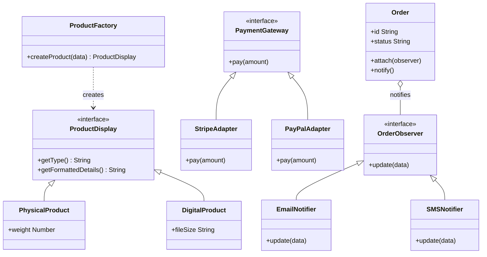

# Sauda Architecture UML (Updated)

Бұл диаграмма жобаның ағымдағы архитектурасын және қолданылған Design Pattern-дерді сипаттайды.

## Түсініктемелер:
- **Product Factory**: Платформадағы тауардың түріне қарай (физикалық немесе цифрлық) тиісті нысанды құрастырады.
- **Payment Adapter**: Әртүрлі төлем жүйелерін (Stripe, PayPal) бір интерфейс арқылы басқаруға мүмкіндік береді.
- **Order Observer**: Тапсырыс статусы өзгергенде пайдаланушыға автоматты түрде хабарлама (Email/SMS) жібереді.
