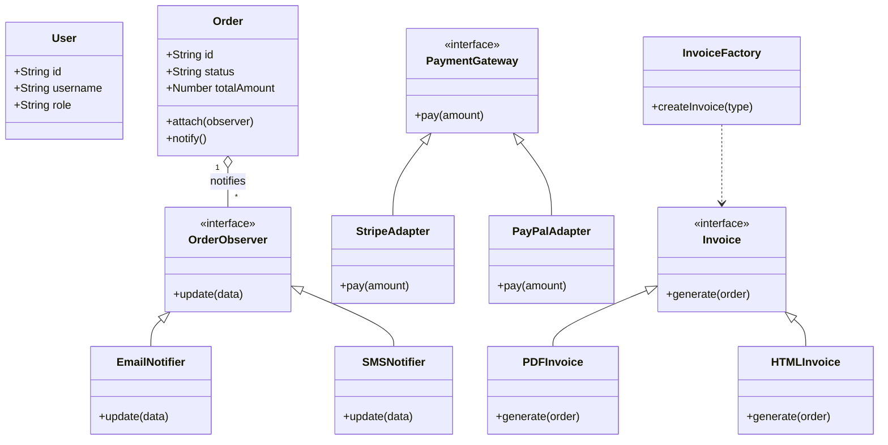

# Sauda E-Commerce Engine - UML Class Diagram

```mermaid
classDiagram
    %% Models
    class User {
        +String id
        +String username
        +String role
    }
    class Order {
        +String id
        +String status
        +Number totalAmount
        +attach(observer)
        +notify()
    }
    
    %% Factory Pattern
    class Invoice {
        <<interface>>
        +generate(order)
    }
    class PDFInvoice { +generate(order) }
    class HTMLInvoice { +generate(order) }
    class InvoiceFactory {
        +createInvoice(type)
    }
    Invoice <|-- PDFInvoice
    Invoice <|-- HTMLInvoice
    InvoiceFactory ..> Invoice
    
    %% Adapter Pattern
    class PaymentGateway {
        <<interface>>
        +pay(amount)
    }
    class StripeAdapter { +pay(amount) }
    class PayPalAdapter { +pay(amount) }
    PaymentGateway <|-- StripeAdapter
    PaymentGateway <|-- PayPalAdapter
    
    %% Observer Pattern
    class OrderObserver {
        <<interface>>
        +update(data)
    }
    class EmailNotifier { +update(data) }
    class SMSNotifier { +update(data) }
    Order "1" o-- "*" OrderObserver : notifies
    OrderObserver <|-- EmailNotifier
    OrderObserver <|-- SMSNotifier
```
