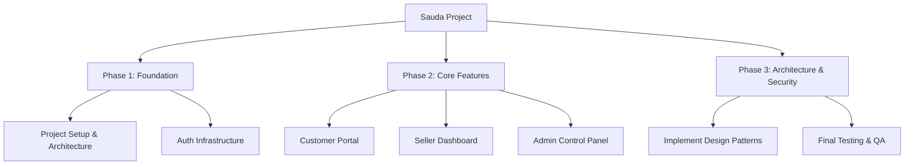
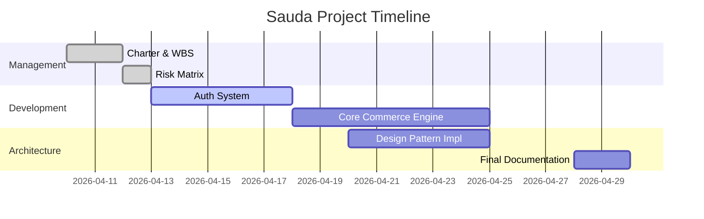

# Work Breakdown Structure (WBS) & Timeline

## 1. WBS Tree

```mermaid
graph TD
    A[Sauda Project] --> B[Phase 1: Foundation]
    A --> C[Phase 2: Core Features]
    A --> D[Phase 3: Architecture & Security]
    
    B --> B1[Project Setup & Architecture]
    B --> B2[Auth Infrastructure]
    
    C --> C1[Customer Portal]
    C --> C2[Seller Dashboard]
    C --> C3[Admin Control Panel]
    
    D --> D1[Implement Design Patterns]
    D --> D2[Final Testing & QA]
```

## 2. Timeline (Gantt Chart)

```mermaid
gantt
    title Sauda Project Timeline
    dateFormat  YYYY-MM-DD
    section Management
    Charter & WBS           :done,    des1, 2026-04-10, 2d
    Risk Matrix             :done,    des2, 2026-04-12, 1d
    section Development
    Auth System             :active,  dev1, 2026-04-13, 5d
    Core Commerce Engine    :         dev2, 2026-04-18, 7d
    section Architecture
    Design Pattern Impl     :         arch1, 2026-04-20, 5d
    Final Documentation     :         arch2, 2026-04-28, 2d
```
