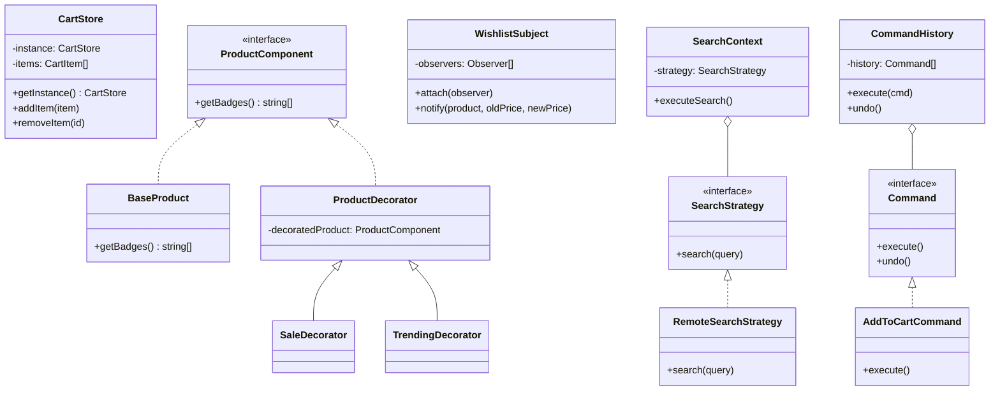

# Design Justification & Architecture

## 1. Architecture Overview (UML Class Diagram)

---

## 2. Pattern Justification

### Creational: Singleton (`CartStore`)
- **Problem:** Multiple components (Catalogue, Checkout, Wishlist) need access to the same shopping cart instance.
- **Solution:** `CartStore` ensures only one instance exists worldwide, preventing data divergence and "orphan" carts. It provides a global access point for order manifest synchronization.

### Structural: Decorator (`ProductComponent`)
- **Problem:** Products need various visual badges (Sale, New, Trending, Out of Stock) based on complex runtime logic without bloat in the base class.
- **Solution:** The Decorator pattern allows us to wrap a product object with multiple "decorators" at runtime. This follows the **Open-Closed Principle (OCP)**—we can add new badge types without modifying the original product class.

### Behavioral: Observer (`WishlistSubject`)
- **Problem:** When a price drops in the marketplace, users with that item in their wishlist must be notified immediately.
- **Solution:** `WishlistSubject` maintains a list of trackers. When a price change is detected during polling, it broadcasts the update to all observers (UI Toasts). This decouples the price tracking logic from the UI notification logic.

### Behavioral: Strategy (`SearchStrategy`)
- **Problem:** Searching requires different logic depending on the target (Marketplace, Network Users, System Protocols) or environment (Remote API vs Local Cache).
- **Solution:** The Strategy pattern encapsulates the search algorithm. `SearchContext` can switch from `RemoteSearchStrategy` to others without the UI knowing the difference, making the system highly flexible for future extensions.

### Behavioral: Command (`CommandHistory`)
- **Problem:** Users need the ability to undo "Add to Cart" actions, and the system needs to record all transactional intents.
- **Solution:** Every cart action is encapsulated as a `Command` object. This allows us to maintain a stack of actions and implement `undo()` efficiently, while also providing a clear log of user activities for auditing.

---

## 3. SOLID Principles Compliance

- **S (Single Responsibility):** Each strategy and command does exactly one thing.
- **O (Open/Closed):** New pricing or search strategies can be added without modifying existing logic.
- **L (Liskov Substitution):** All `SearchStrategy` implementations are interchangeable in `SearchContext`.
- **I (Interface Segregation):** Observers and Commands use minimal, focused interfaces.
- **D (Dependency Inversion):** High-level components depend on `SearchStrategy` (abstraction) rather than `RemoteSearchStrategy` (concrete).
