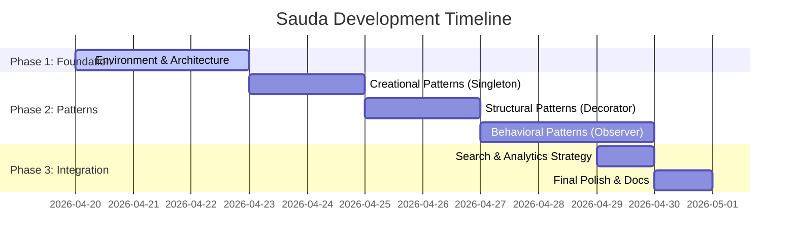

# Project Management Plan: Sauda "Enterprise-Ready" E-commerce

## 1. Project Charter & Scope (MVP)
**Project Name:** Sauda Digital Commerce Infrastructure
**Goal:** Develop a scalable, pattern-driven e-commerce engine for asset management and global trade.

### Minimum Viable Product (MVP) Scope:
- **Authentication:** Secure node login for Users, Sellers, and Admins.
- **Marketplace:** Real-time asset catalogue with dynamic pricing strategies.
- **Wishlist & Surveillance:** Automated price change notifications via Observer pattern.
- **Cart System:** Command-based order preparation with undo/redo capabilities.
- **Global Search:** Strategy-based intelligence search across products and network nodes.
- **Admin Control:** Revenue tracking and inventory synchronization.

### Constraints:
- Must adhere to strictly typed TypeScript interfaces.
- Zero-latency UI updates using motion animations.
- Full compliance with SOLID principles.

---

## 2. Risk Management Plan

| Risk ID | Risk Description | Impact | Probability | Mitigation Strategy |
|---------|------------------|--------|-------------|---------------------|
| R01 | Technical Debt (Modular complexity) | High | Medium | Use strict Design Patterns (Strategy/Adapter) to decouple components. |
| R02 | Scope Creep (Additional Features) | Medium | High | Strict adherence to the MVP Charter and Sprint goals. |
| R03 | Synchronous Data Bottlenecks | High | Low | Implement Singleton stores for state management (CartStore). |
| R04 | Identity Spoofing | Critical | Low | Role-based Access Control (RBAC) and data sanitization on server. |
| R05 | Fragile UI Stacking | Medium | Medium | Use atomic Component design and Tailwind CSS for visual consistency. |

---

## 3. Work Breakdown Structure (WBS)

1. **Phase 1: Foundation**
   - 1.1 Terminal Environment Setup
   - 1.2 Database Schema Design (Asset/User manifests)
   - 1.3 Core Pattern Primitives (Subject, Command interfaces)

2. **Phase 2: Core Engineering**
   - 2.1 Creational Layer (Singleton Service Stores)
   - 2.2 Structural Layer (Product Decorators, Card Adapters)
   - 2.3 Behavioral Layer (Pricing Strategies, Cart Commands)

3. **Phase 3: Intelligence & UX**
   - 3.1 Observer-based Notification Hub
   - 3.2 Strategy-based Global Search
   - 3.3 Motion-enhanced UI/UX polish

---

## 4. Timeline & Scheduling (Gantt Chart)

