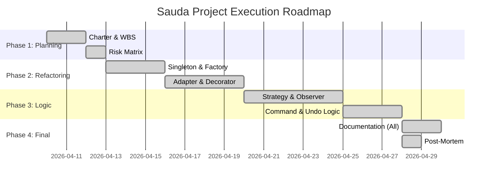

# Work Breakdown Structure (WBS) & Timeline
## Sauda Digital Commerce Infrastructure

### 1. Work Breakdown Structure (WBS)
- **1.0 Management Cluster**
  - 1.1 Project Charter & Scope Definition
  - 1.2 Risk Management Matrix
  - 1.3 Post-Mortem Analysis
- **2.0 Architectural Backbone (Design Patterns)**
  - 2.1 Creational Layer (Factory, Singleton)
  - 2.2 Structural Layer (Adapter, Decorator)
  - 2.3 Behavioral Layer (Observer, Strategy, Command)
- **3.0 Frontend Infrastructure**
  - 3.1 Customer Portal (Catalog, Tracking, Comparison)
  - 3.2 Seller Panel (Inventory, Invoice synthesis)
  - 3.3 Admin Panel (Analytics & Approvals)
- **4.0 Server-Side Orchestration**
  - 4.1 Order Processing (Observer-driven)
  - 4.2 Dynamic Pricing Logic (Strategy-driven)
  - 4.3 Payment Adapters

### 2. Timeline (Gantt Chart)

### 3. Critical Path
The critical path involved the **Refactoring of the Cart state** (Singleton) and the **Order lifecycle** (Observer), as these formed the dependency foundation for the subsequent Command and Strategy patterns.
